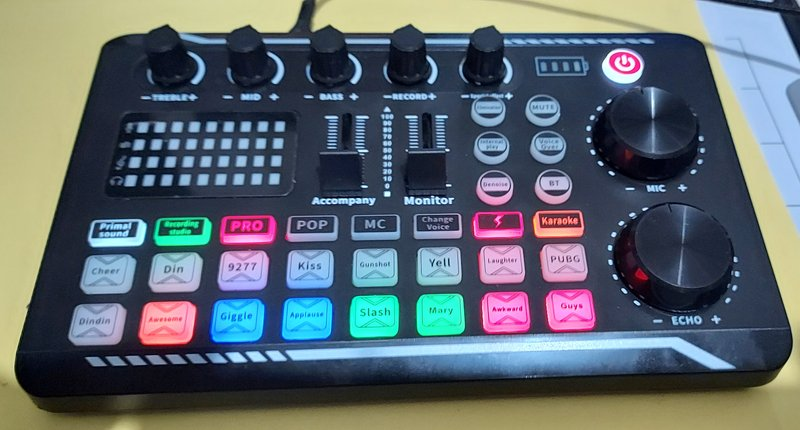

El F998 se vende en AliExpress  como "Live Sound Card Audio Mixer With Interface DJ Mixer Effects Voice Changer Bluetooth-compatible Mixer For Live Streaming Singing" a un precio muy asequible, del orden de 15€.

Este proyecto lo convirte en un panel universal para PC con
* 31 botones
* 7 potenciometros
* 2 faders
* 71 leds

Hemos reemplazado el DSP que lleva por un Arduino Pro Micro, crado un firmware en Arduino IDE, un protocolo de comunicaciones y un script Python para aprovechar el hardware del F998.

El diseño es totalmente flexible. Se puede utilizar tal cual con un ordenador con Linux, ampliar o modificar los modos definidos en el script Python o incluso usar solo el firmware arduino y reemplazar la parte del PC por cualquier otra aplicacion en cualquier sistema operativo.

# F998 – Panel de Control Programable

## 📌 Introducción

**F998** es un panel de control físico programable diseñado para interactuar con aplicaciones de escritorio mediante **comunicación serie**, sin utilizar HID.

El sistema combina:

- Hardware dedicado (botones, potenciómetros y LEDs)
- Firmware propio (Arduino)
- Software en Python con arquitectura por modos

El objetivo es ofrecer un **control ergonómico, fiable y visualmente claro** para edición de vídeo, reproducción multimedia y automatización personalizada.

---

## 🧱 Arquitectura del sistema

La arquitectura de F998 está basada en una **separación clara de responsabilidades**:

- Hardware: entradas y salidas físicas
- Firmware: abstracción del panel y protocolo estable
- Software PC: lógica de aplicación y modos

📄 **Documento de referencia**:
- 👉 [f998_arquitectura_general](doc/f_998_arquitectura_general.md)

---

## 🧭 Guía de usuario

Si eres usuario del panel y quieres aprender a utilizarlo en el día a día:

📄 **Guía de Usuario Final**:
- 👉 [f998_guia_usuario_final](doc/f_998_guia_usuario_final.md)

Incluye:
- funcionamiento general del panel
- interpretación de LEDs y parpadeos
- uso de los distintos modos
- buenas prácticas

---

## 🔁 Modos disponibles

El panel funciona siempre en **un único modo activo**. Cada modo define su propio comportamiento, controles y feedback visual.

### ▶️ Modo Kdenlive

Control especializado para **edición de vídeo en Kdenlive**:

- play / pausa
- navegación por frames y segundos
- zoom del timeline
- cambio de pistas
- corte de clips

📄 Documentación técnica:
- 👉 [f998_modo_kdenlive_documentacion](doc/f_998_modo_kdenlive_documentacion.md)

---

### ▶️ Modo SMPlayer

Control remoto avanzado para **reproducción de vídeo en SMPlayer / mpv**:

- play / pausa
- navegación temporal
- control de volumen (SMPlayer y sistema)
- captura de pantalla
- saltos precisos mediante IPC

📄 Documentación técnica:
- 👉 [f998_modo_smplayer_documentacion](doc/f_998_modo_smplayer_documentacion.md)

---

### ▶️ Modo Macros

Modo de **automatización configurable** mediante archivo YAML:

- ejecutar comandos
- enviar combinaciones de teclas
- escribir texto y snippets
- ejecutar secuencias de acciones

📄 Documentación técnica:
- 👉 [f998_modo_macros_documentacion](doc/f_998_modo_macros_documentacion.md)

---

## 📁 Configuración

- Las macros se definen en el archivo [macros.yaml](software/macros.yaml)
- Los modos están implementados en Python y seleccionados desde un bucle principal
- El firmware Arduino expone una API estable independiente del uso final

---

## 🎛️ Filosofía del proyecto

- No usar HID
- Feedback visual constante
- Control explícito del estado
- Robustez frente a errores
- Extensibilidad por diseño

El panel puede evolucionar añadiendo nuevos modos sin modificar la base del sistema.

---

## 🚀 Estado del proyecto

- Arquitectura definida
- Modos principales implementados
- Documentación completa
- Uso real validado

**F998 v1** se considera una base sólida y cerrada, lista para evolución futura.

---

## 📄 Documentos incluidos

- [f998_arquitectura_general](doc/f_998_arquitectura_general.md) – arquitectura del sistema
- [f998_guia_usuario_final](doc/f_998_guia_usuario_final.md) – guía de usuario
- [f998_modo_kdenlive_documentacion](doc/f_998_modo_kdenlive_documentacion.md) – modo Kdenlive
- [f998_modo_smplayer_documentacion](doc/f_998_modo_smplayer_documentacion.md) – modo SMPlayer
- [f998_modo_macros_documentacion.md](doc/f_998_modo_macros_documentacion.md) – modo Macros

---

> **Nota final**: F998 es un proyecto diseñado para crecer. Esta documentación refleja el estado actual del sistema y sirve como referencia para futuras ampliaciones.

