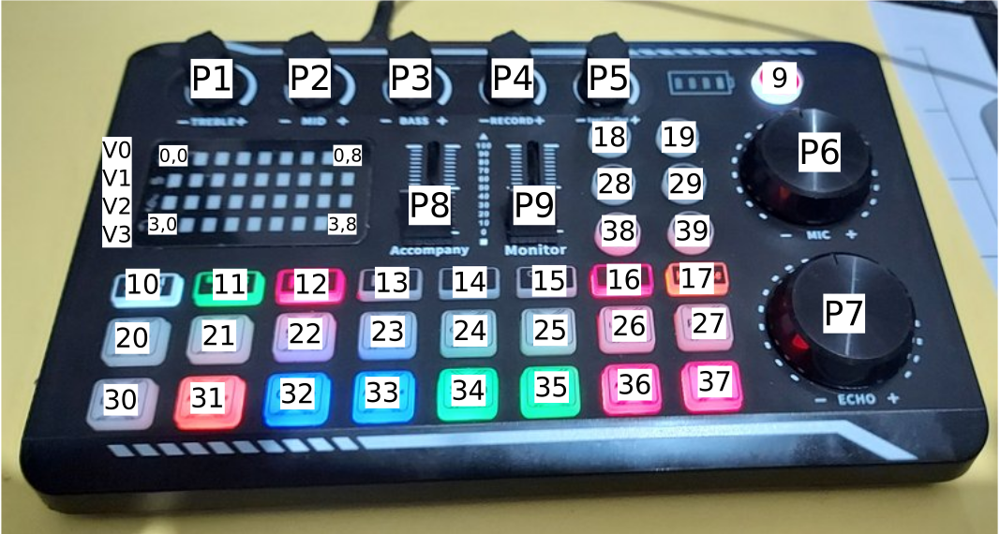

En esta carpeta se encuentra la documentación del proyecto una vez se ha realizado la modificación del Hardware
* Firmware Arduino
* Protocolo de comunicación
* Script Python
* Modos implementados
  * Modo kdenlive
  * Modo SMPlayer
  * Modo Macros

  
  
