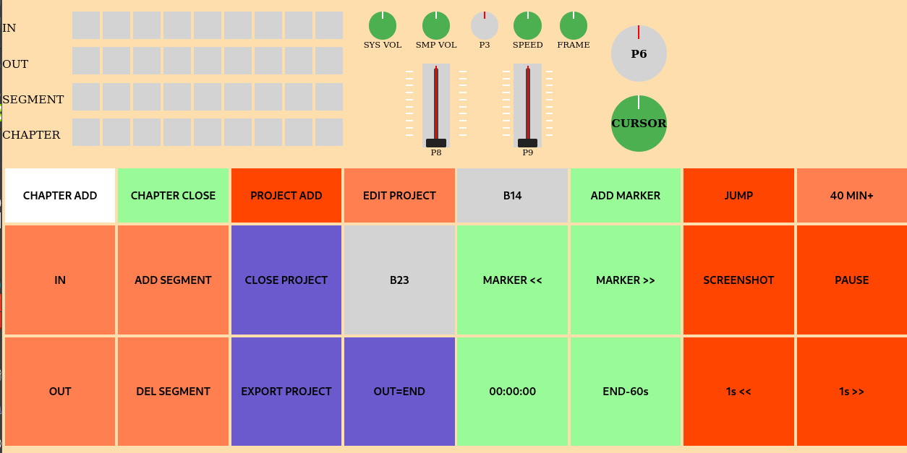

# Modo PreEditor -- F998



## 📌 Descripción general

El **Modo PreEditor** del panel **F998** está diseñado para crear
proyectos de segmentación a partir de material reproducido en
**SMPlayer/mpv**.

Su función es definir cortes y generar un archivo JSON estructurado que
será procesado posteriormente por un componente externo denominado
**worker.py**.

PreEditor no edita vídeo. Solo define estructura.

------------------------------------------------------------------------

## 🎛️ Filosofía de funcionamiento

-   SMPlayer actúa como visor
-   El panel F998 permite marcar segmentos con precisión física
-   Se genera un JSON coherente y validado
-   El procesamiento real lo realiza `worker.py`
-   No se modifica el archivo original

PreEditor es una capa lógica sobre el Modo SMPlayer.

------------------------------------------------------------------------

## 🔁 Activación del modo

-   Asociado al **botón 28**

Estados del botón: - Encendido fijo → modo activo con foco - Parpadeo →
SMPlayer no tiene foco

Al entrar: - Se limpian LEDs - Se inicializa estado de proyecto - Se
activa entorno de segmentación

------------------------------------------------------------------------

## 🔍 Control de foco

Se utiliza el mismo sistema que en SMPlayer:

-   Si SMPlayer no tiene foco → no se envían comandos
-   El botón 28 parpadea
-   Al recuperar foco → funcionamiento normal

------------------------------------------------------------------------

# 🎬 Controles heredados de SMPlayer

PreEditor hereda íntegramente:

-   Play / Pause
-   Seek ±1 segundo (botones 36 / 37)
-   Frame stepping dinámico (digPot(5))
-   Control absoluto de velocidad (digPot(4): 1/8× a 8×)
-   Navegación (digPot(7))
-   Volumen interno (digPot(2))
-   Volumen sistema (digPot(1))
-   Seek absoluto (botón 16)
-   Salto rápido +40 min (botón 17)

PreEditor no redefine comportamiento multimedia.

------------------------------------------------------------------------

# 🗂️ Gestión de proyecto

## 🆕 Nuevo proyecto -- Botón 12

-   Pausa reproducción
-   Solicita nombre por diálogo Tk
-   Inicializa:

``` json
{
  "project_name": "...",
  "jobs": []
}
```

------------------------------------------------------------------------

## ❌ Cerrar proyecto -- Botón 22

-   Solicita confirmación
-   Limpia estado interno
-   Reinicia matriz

------------------------------------------------------------------------

## 💾 Exportar proyecto -- Botón 32

Genera archivo:

    f998_project_YYYYMMDD_HHMMSS.json

Incluye:

-   project_name
-   jobs
-   created_at

------------------------------------------------------------------------

# 📂 Gestión de capítulos

## 🎬 Nuevo capítulo -- Botón 10

-   Pausa reproducción
-   Solicita nombre (ej: 1x03)
-   Guarda:
    -   output
    -   source (ruta del vídeo)
-   Reinicia segmentos

------------------------------------------------------------------------

## ✅ Guardar capítulo -- Botón 11

Añade entrada en `jobs`:

``` json
{
  "output": "1x03",
  "source": "/ruta/video.mkv",
  "segments": [...]
}
```

Se actualiza la matriz de capítulos cerrados.

------------------------------------------------------------------------

# ✂️ Segmentación

## ⬅️ Marcar IN -- Botón 20

Guarda posición actual (`time-pos`).

------------------------------------------------------------------------

## ➡️ Marcar OUT -- Botón 30

Guarda posición actual (`time-pos`).

------------------------------------------------------------------------

## 🔚 Marcar END -- Botón 33

Marca OUT como:

``` json
"END"
```

El valor `"END"` será interpretado por `worker.py` como final real del
archivo.

------------------------------------------------------------------------

## ➕ Añadir segmento -- Botón 21

Condiciones válidas:

-   IN definido
-   OUT definido
-   OUT \> IN o
-   OUT == "END"

Se añade:

``` json
{
  "in": 123.45,
  "out": "END"
}
```

------------------------------------------------------------------------

## 🗑️ Eliminar último segmento -- Botón 31

Elimina el último segmento en memoria.

------------------------------------------------------------------------

# 🧱 Matriz 4×9

Indicadores visuales estructurales:

-   Fila 0 → IN provisional
-   Fila 1 → OUT provisional
-   Fila 2 → Segmentos del capítulo actual (máx. 8)
-   Fila 3 → Capítulos cerrados (jobs)

Cada capítulo guardado enciende un LED en fila 3. Máximo visible: 8
capítulos.

------------------------------------------------------------------------

# 📝 Editor JSON integrado -- Botón 13

Permite:

-   Abrir editor Tk en modo oscuro
-   Visualizar JSON formateado
-   Editar manualmente
-   Validar coherencia estructural

Validación:

-   Objeto raíz
-   project_name presente
-   jobs es lista
-   Cada segmento contiene `in` y `out`
-   `out` puede ser número o `"END"`

No se acepta JSON inválido.

------------------------------------------------------------------------

# 🧠 Relación con worker.py

El archivo JSON exportado es procesado por `worker.py`.

Responsabilidades del worker:

-   Interpretar `"END"` como final del archivo fuente
-   Ejecutar cortes reales
-   Generar archivos de salida
-   Gestionar codificación y concatenación si procede

PreEditor no realiza ningún procesamiento de vídeo.

------------------------------------------------------------------------

# ✔️ Flujo de trabajo típico

1.  Crear proyecto
2.  Crear capítulo
3.  Marcar IN
4.  Marcar OUT o END
5.  Añadir segmento
6.  Guardar capítulo
7.  Repetir
8.  Exportar JSON
9.  Ejecutar worker.py sobre el JSON

------------------------------------------------------------------------

# ✔️ Estado del modo

-   Funcional
-   Estable
-   Integrado con SMPlayer
-   Preparado para pipeline externo mediante worker.py

El **Modo PreEditor** se considera estable (v1).
