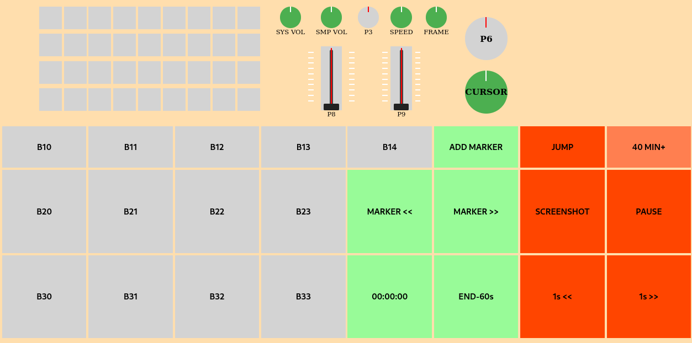

# Modo SMPlayer – F998

## 📌 Descripción general

El **Modo SMPlayer** del panel **F998** está orientado al control avanzado y preciso de la reproducción de vídeo mediante **SMPlayer** (backend **mpv**), utilizando controles físicos y comunicación IPC directa.

Este modo combina:
- atajos de teclado nativos
- comandos directos a **mpv vía socket IPC**

para garantizar un comportamiento determinista y no acumulativo.

---

## 🎛️ Filosofía de funcionamiento

- El panel actúa como control remoto físico avanzado
- No se utiliza HID
- Se prioriza IPC cuando es posible
- Los botones activos permanecen encendidos
- El parpadeo indica estado alternativo (pausa o foco incorrecto)

---

## 🔁 Activación del modo

- Asociado al **botón 38**

Estados del botón 38:
- Encendido fijo → modo activo con foco
- Parpadeo → modo activo sin foco

Al entrar en el modo:
- Se apagan todos los LEDs
- Se encienden únicamente los controles operativos

---

## 🔍 Control de foco

Antes de ejecutar acciones:

- Se verifica que SMPlayer tenga el foco real
- Si no lo tiene:
  - No se envían órdenes
  - El botón 38 parpadea
- Al recuperar foco:
  - El botón queda fijo
  - Se reanudan las acciones

---

## ⏱️ Delays

- Delay humano botones: 300 ms
- Frame stepping dinámico en digPot(5):
  - Movimiento leve → con delay
  - Movimiento fuerte → sin delay

---

# 🎚️ Controles asignados

## 🔄 Ruedas digitales (digPot)

### 🎞️ Navegación – digPot(7)

| Valor | Acción |
|--------|--------|
| 0 | PageDown |
| 1 | Flecha abajo |
| 2 | Flecha izquierda |
| 3 | Centro |
| 4 | Flecha derecha |
| 5 | Flecha arriba |
| 6 | PageUp |

Permite navegación por línea de tiempo y saltos finos.

---

### 🎬 Frame stepping – digPot(5)

| digPot(5)-3 | Acción |
|--------------|--------|
| ≤ -2 | Frame anterior (sin delay) |
| -1 | Frame anterior (con delay) |
| 0 | Sin acción |
| +1 | Frame siguiente (con delay) |
| ≥ +2 | Frame siguiente (sin delay) |

Permite control fino o scrubbing rápido.

---

### ⚡ Velocidad de reproducción – digPot(4)

Control absoluto vía IPC (`set_property speed`):

| digPot(4)-3 | Velocidad |
|--------------|------------|
| -3 | 1/8× |
| -2 | 1/4× |
| -1 | 1/2× |
| 0 | 1× |
| +1 | 2× |
| +2 | 4× |
| +3 | 8× |

- No es acumulativo
- Siempre fija velocidad absoluta
- Solo se envía comando cuando cambia la posición

---

### 🔊 Volumen SMPlayer – digPot(2)

- 9 → subir volumen
- 0 → bajar volumen

Control interno del reproductor.

---

### 🔊 Volumen del sistema – digPot(1)

- Control global vía `amixer`
- Independiente del volumen interno

---

# ⌨️ Botones

## ▶️ Play / Pause – Botón 27

- Acción: Espacio

LED:
- Fijo → reproducción
- Parpadeo → pausa

Estado sincronizado vía IPC.

---

## ⏪⏩ Salto ±1 segundo – Botones 36 / 37

- 36 → seek_relative(-1)
- 37 → seek_relative(+1)

Implementado por IPC.

---

## ⏩ Avance rápido de capítulo – Botón 17

- seek_relative(2400)
- Salto exacto de 40 minutos
- Implementado por IPC

---

## 🎯 Seek absoluto – Botón 16

- Abre diálogo Tk
- Permite introducir segundos (float)
- Ejecuta seek absoluto
- Validación numérica básica

---

## 📸 Captura de pantalla – Botón 26

- Acción: tecla S

---

## 🔖 Marcadores

| Botón | Acción |
|--------|--------|
| 15 | Ctrl+A |
| 24 | Ctrl+B |
| 25 | Ctrl+N |

---

# 🧠 Comunicación con mpv

SMPlayer lanza mpv con:

--input-ipc-server=/tmp/mpvsocket

Se utilizan:

- seek
- set_property speed
- get_property pause
- get_property time-pos

Comunicación directa y determinista.

---

# 🎛️ Indicadores visuales

## 🔋 Barra de batería

Indica dirección e intensidad de desplazamiento.

## 🧱 Matriz 4×9

No utilizada en este modo.

---

# 🧠 Estado interno

Mantiene:

- Estado reproducción/pausa
- Última velocidad establecida
- Control de frame stepping
- Estado de foco

---

# ✔️ Estado del modo

- Funcional
- Estable
- Determinista
- Control absoluto de velocidad y seek

El **Modo SMPlayer** se considera actualmente estable (v2).
