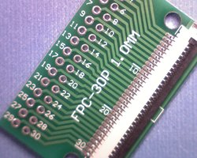
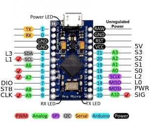
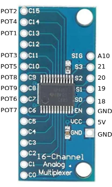
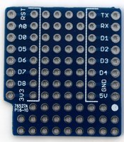
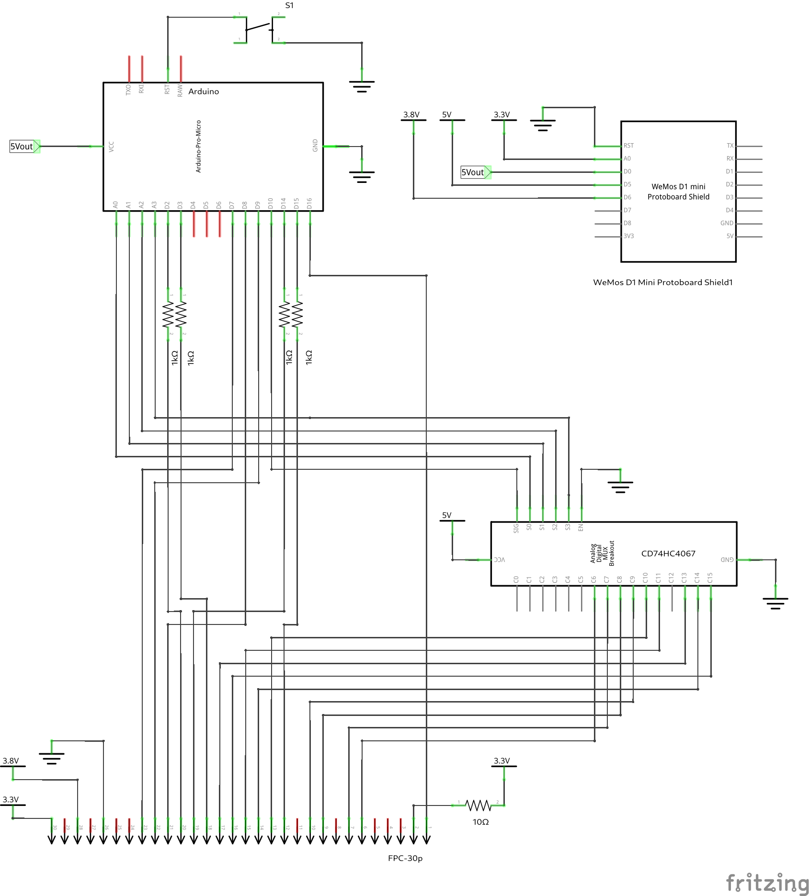
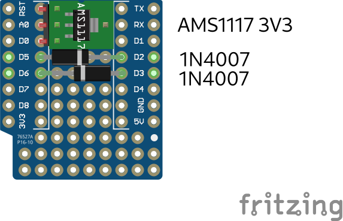
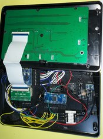
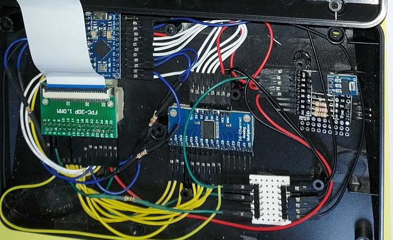

# Modificación del hardware

## Materiales necesarios

* Arduino Pro Micro USB-C
* Módulo CD74HC4067
* Adaptador FPC-30p 1mm a 2.54mm. Importante: el modelo ha de ser el que el conector apreta los contactos de la manguera contra el PCB, ver foto
* Regulador LDO 3V3 (AMS1117 3V3, pero los hay mejores)
* 2 diodos 1N4007
* placa de prototipos D1 mini (opcional) para conectar los 1N4007 y el LDO 
* Pequeña placa de prototipos de tira con 2 conectores: 3V3 y GND
* Cables Dupont F-F 10 cm

##  Preparación de la caja

Primero debemos abrir la caja. Me fue muy útil un [vídeo en YouTube](https://www.youtube.com/watch?v=PxLtwtSuTzQ) . Importante: la mayoría de tornillos se hallan debajo de las patas adhesivas.

Una vez abierta la caja veremos dos placas unidas por una manguera flexible: la PCB atornillada a la tapa con los leds, botones y potenciómetros (la que queremos reutilzar en nuestro panel); y la PCB atornillada a la parte inferior, estrecha con un DSP y los conectores de audio, conectada a una bateria, que vamos a rremplazar por nuestro Arduino Pro Micro.

* Quitamos los 2 tornillos que fijan la PCB del DSP a la base
* Desconectamos la manguera por el extremo de la PCB del DSP a cuyo oonector podemos acceder ahora
* Sacamos placa del DSP y la bateria. No las usaremos

## Poner el hardware propio

En la caja pondremos en su lugar:
* Arduino Pro Micro USB-C
* Módulo CD74HC4067
* Adaptador FPC-30p
* Regulador LDO 3V3 y 2 diodos 1N4007. Yo utilicé una *placa de prototipos D1 mini* para conectarlos, y como LDO un AMS1117 3V3
* Pequeña placa de prototipos de tira con 2 conectores: 3V3 y GND

Yo los fijé a la caja con cinta adhesiva doble cara de vinilo: me va genial.

El Arduino Pro Micro aprovecha la abertura serigrafiada *OTG/PC Live* para su conector USB-C. Hará falta limar un poco el divisor plástico interior para que encaje perfectamente.

El Adaptador FPC-30p ha de ir alineado con la manguera de la tapa. Recomiendo fijarlo al final, cuando se haya hecho todo el cableado y probado el sistena.

Soldaremos conectores en codo angulo recto para facilitar mantener la altura del conjunto. El conector FPC30 necesitará un conector en codo 2x15

### Cableado

Usaremos cables Dupont hembra-henbra de 10 cm. Yo he usado normales, pero los de silicona van de fábula. Con el poco espacio que tenemos desaconsejo los de manguera, son muy rígidos.

* Pondremos cables directos para todas las conexiones del CD74HC4067 y el arduino y el conector FPC30
* Cables directos para DIO STB CLK entre el conector FPC30 y el arduino
* Los 5V que salen del arduino van a 5V IN de la placa D1mini
* 5V OUT de D1mini a 5V CD74HC4067
* pin GND izquierdo de arduino a GND de FPC30
* 3V8 OUT de D1mini a V2 FPC30
* 3V3 OUT e D1mini a PCB de tiras, de ahí toman el resto de componentes los 3V3, uno de ellos a V1 FPC30
* Los DIO CLK STB de D1mini no se usan, son restos de pruebas anteriores
* pin GND derecho del arduino a PCB de titras, de ahí toman el resto de componentes GND
* POT8 POT9 a FAD1 FAD2
* Los cables que unen el conector con el Arduino Pro Micro L0 L1 L2 y L3 llevan una resistencia de 1k en serie. Lo más práctico es cortar el cable, soldar la resistencia y proteger la unión con termoretráctil
* pin 16 de Arduino a PWR FPC30
* Si ponemos un cable del conector FPC30 D25 D74 a 3V3 con 100R en serie tendremoa el led de PWR continuamente encendido
* Podemos conectar un pulsador entre el RST del Arduino Pro Micro y GND, colocandolo en uno de los agujeros de los antiguos conectores de audio para permitir su acceso.

